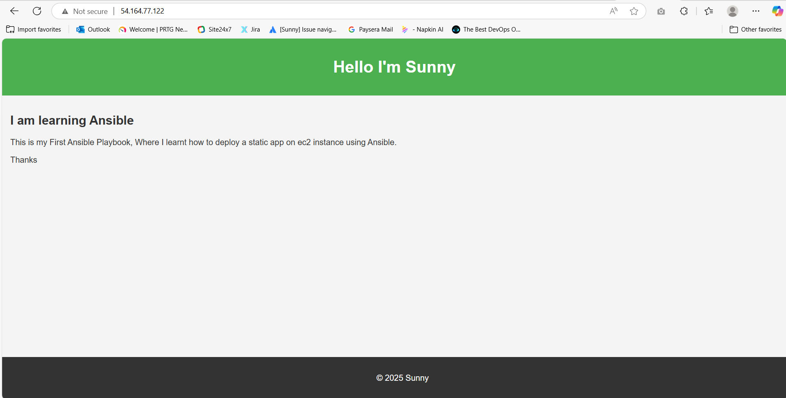

# Ansible Web App Deployment

This is my first Ansible playbook, where I learned how to deploy a static web page on an EC2 instance.

## Features
- Installs Apache web server (`apache2`)
- Copies a static `index.html` file to `/var/www/html`
- Sets ownership and file permissions


## Requirements

    Ubuntu/Debian-based EC2 instance

    Ansible installed on the control machine

    SSH access to the target instance

## Screenshot

Below is the webpage after successful deployment:


### How to Run
```bash
ansible-playbook -i inventory playbook.yml

---

### Thanks for checking it out!


---

Let me know if you want this whole folder structure as a `.zip` file to make things easier.
